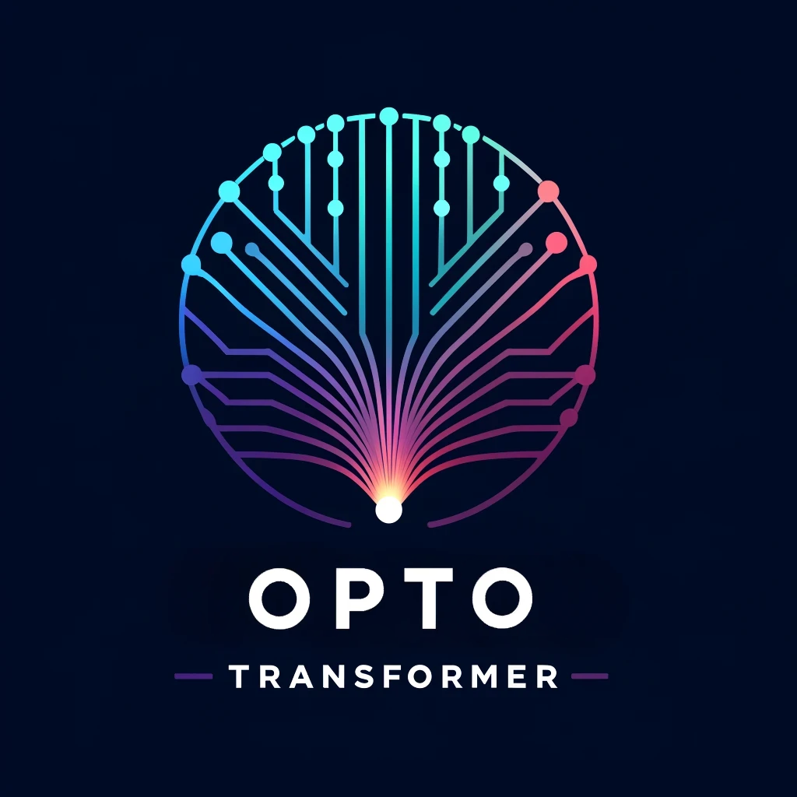

# OptoTransformer for VCSEL Parameters Prediction



## Project Overview
This project applies a transformer-based machine learning model to predict various parameters of Vertical-Cavity Surface-Emitting Lasers (VCSELs) from their structural data. The implementation leverages deep learning techniques to understand and predict critical performance metrics from VCSEL architectures. The key research paper associated with this project is currently under submission.

## Demo
To experience the capabilities of the OptoTransformer firsthand, visit my interactive web interface available at:
[OptoTransformer Demo](https://loading-opto-transformer.onrender.com)

This demo allows you to use a pre-trained transformer model to predict VCSEL parameters directly through your web browser. It's a great way to quickly see the practical applications of our research and the effectiveness of the transformer model in real-time prediction.


## Features
- **Data Processing**: Convert raw VCSEL, DBR, or Fabri-Perot data into a format suitable for machine learning models.
- **Model Training**: Train the transformer model on processed VCSEL data.
- **Evaluation and Testing**: Assess model performance on a split test dataset.
- **Prediction**: Predict VCSEL parameters from new data samples.

## Installation
1. Clone this repository.
2. Install required Python packages:
```bash
pip install -r requirements.txt
```

## Usage

The OptoTransformer project is designed for flexibility, allowing users to operate through both command line arguments and configuration files. This dual approach ensures that users can quickly switch between different operational modes and experimental setups without altering the code.

To run the project, you can use the following commands:
- **Training the Model**:
```bash
python main.py --train
```
- **Testing the Model**:
```bash
python main.py --test
```
- **Making Predictions**:
```bash
python main.py --predict
```

Each command loads configurations from `config.yaml`, but can be overridden by additional command line arguments, providing a dynamic and user-friendly interface for various experimental needs.

## Configuration
Modify `config.yaml` as per your requirements.
Modify `model_params.yaml` as per your requirements for model.

## Note
After the main research article associated with this project is published, additional files such as `generate_data_embeddings.py` and `transformer_model.py` will be added.

### Copyright

© 2024, Aleksei Belonovskii